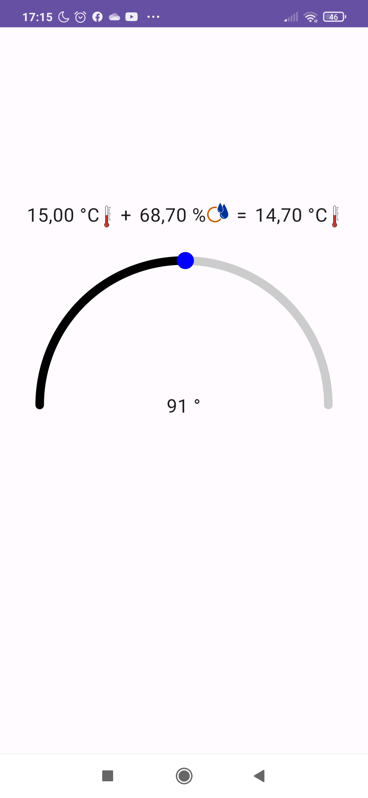
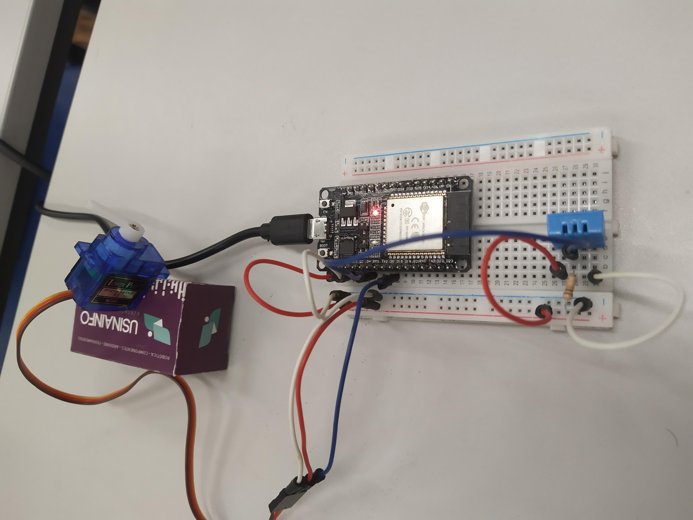

# SensorApp

> Android app that communicates with external sensors through MQTT.

## Table of Contents

- [Overview](#overview)
- [Features](#features)
- [Hardware desciption](#hardware-description)
- [Software description](#software-description)
- [Usage](#usage)
- [Contribution](#contribution)

## Overview

The app comunicates through MQTT with a servo motor, controlling its rotation, and with a DHT11, showing its data. Both sensors are managed by a ESP32 board.

## Features

- Control servo rotation: drag the circular slider to the desired angle.
- Get DHT11 data: show temperature, humidity and heat index.

## Hardware description

- ESP32 board.
- 10 kΩ resistor.
- DHT11 temperature and humidity sensor.
- SG90 servo motor.
- Jumpers.
- Android phone or simulator.

## Software description
- Android
  - [HiveMQ](https://github.com/hivemq) for MQTT communication.
  - Jetpack compose for building the screen.
  - Hilt for dependency injection.
  - Assets from [Free SVG](https://freesvg.org/) website.
- ESP32
  - Arduino IDE.
  - `ESP32Servo.h` for servo control.
  - `DHT.h` for DHT11 data.
  - `PubSubClient.h` for MQTT topics publishing and subscription.
  - `WiFi.h` for internet connection.
- Broker
  - I've used the [HiveMQ](https://www.hivemq.com/public-mqtt-broker/) public broker, but it's also possible to use a custom one like [Mosquitto](https://www.google.com/search?channel=fs&client=ubuntu-sn&q=mosquitto). For MQTT over TLS this app should have some configs more, but the [HiveMQ](https://github.com/hivemq) library also provides this feature.

## Usage

 

## Contribution

- The circular slider was based on [ComposeCircularSlider](https://github.com/Debdutta-Panda/ComposeCircularSlider) project.

- Schematic diagrams for [servo motor](https://randomnerdtutorials.com/esp32-servo-motor-web-server-arduino-ide/) and [DHT11](https://randomnerdtutorials.com/esp32-dht11-dht22-temperature-humidity-sensor-arduino-ide/) sensors.
